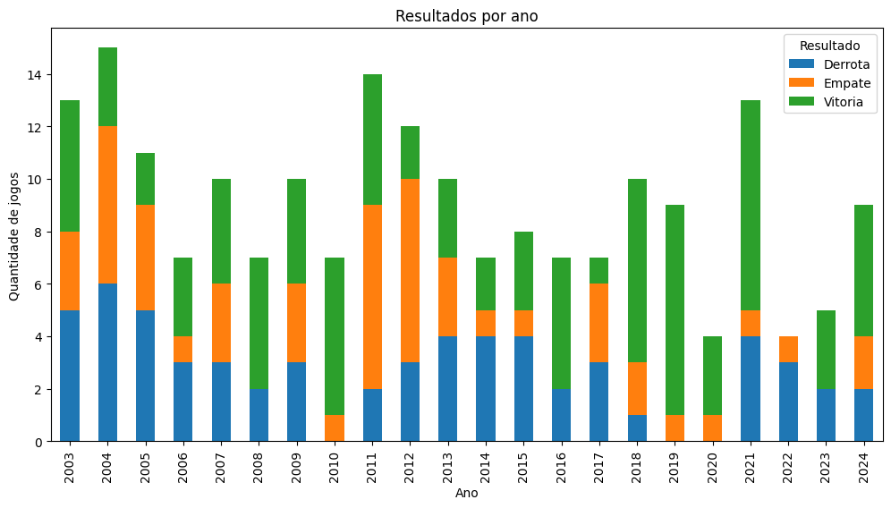
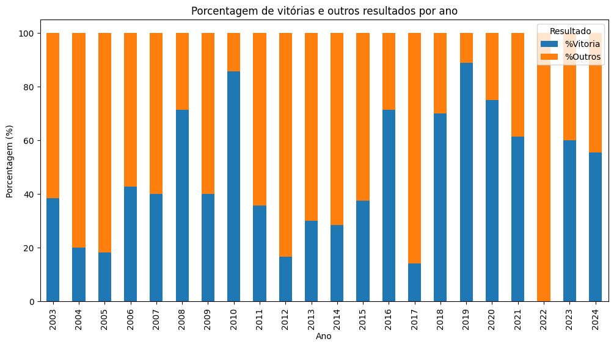

# 📊 Análise dos Jogos do Flamengo após Pausa para Data FIFA

Este projeto foi feito para treinar manipulação de dados e realiza uma análise dos resultados do **Flamengo** nos jogos imediatamente após as pausas para **datas FIFA**, utilizando dados históricos de partidas do Campeonato Brasileiro e da Seleção Brasileira.

---
## ⚽ Contexto

A ideia principal foi verificar se o desempenho do Flamengo sofre algum padrão ou alteração quando o time volta a campo após os jogos da Seleção Brasileira em datas FIFA.  

Durante a análise, os resultados foram categorizados como:
- **Vitória**
- **Empate**
- **Derrota**

---

## 📈 Resultados Gerais

Os resultados do Flamengo após as pausas para datas FIFA apresentaram a seguinte distribuição:

- 🏆 **Vitórias**: 43,7%  
- ❌ **Derrotas**: 30,6%  
- 🤝 **Empates**: 25,6%  

➡️ Ou seja, em **quase metade dos jogos o Flamengo venceu**, mas ainda assim, **mais de 56% dos jogos terminaram em empate ou derrota**.  

---

## 📊 Resultados por Ano (Vitórias x Outros)

| Ano | %Vitória | %Outros |
|-----|----------|---------|
| 2003 | 38,5% | 61,5% |
| 2004 | 20,0% | 80,0% |
| 2005 | 18,2% | 81,8% |
| 2006 | 42,9% | 57,1% |
| 2007 | 40,0% | 60,0% |
| 2008 | 71,4% | 28,6% |
| 2009 | 40,0% | 60,0% |
| 2010 | 85,7% | 14,3% |
| 2011 | 35,7% | 64,3% |
| 2012 | 16,7% | 83,3% |
| 2013 | 30,0% | 70,0% |
| 2014 | 28,6% | 71,4% |
| 2015 | 37,5% | 62,5% |
| 2016 | 71,4% | 28,6% |
| 2017 | 14,3% | 85,7% |
| 2018 | 70,0% | 30,0% |
| 2019 | 88,9% | 11,1% |
| 2020 | 75,0% | 25,0% |
| 2021 | 61,5% | 38,5% |
| 2022 | 0,0% | 100,0% |
| 2023 | 60,0% | 40,0% |
| 2024 | 55,6% | 44,4% |

---

## 💬 Observações Importantes

- O desempenho é **muito irregular ao longo dos anos**.  
- Destaques positivos:  
  - **2010 (85,7%)**, **2019 (88,9%)** e **2020 (75,0%)**, com grande número de vitórias.  
- Destaques negativos:  
  - **2012 (16,7%)**, **2017 (14,3%)** e **2022 (0,0%)**, com aproveitamento baixíssimo.  
- A tendência recente (2023–2024) mostra **recuperação**, com mais de 55% de vitórias.  

Isso sugere que **não há um padrão fixo**, mas sim variações ligadas ao **contexto de cada temporada** (elenco, convocações, calendário e adversários).  

---

## 📊 Visualizações

### 🔹 Resultados por Ano
Distribuição dos resultados (Vitórias, Empates e Derrotas) do Flamengo após as pausas da Seleção:

---

### 🔹 Porcentagem de Vitórias vs Outros Resultados
Análise percentual do desempenho do Flamengo após as pausas:

---

## 🚀 Conclusão

Os dados mostram que o Flamengo tem um desempenho **muito oscilante** após as datas FIFA:  
- Em alguns anos, o time volta **forte e dominante** (2010, 2019, 2020).  
- Em outros, o rendimento cai bastante, chegando até a **0% de vitórias em 2022**.  

No geral, o aproveitamento é de **43,7% de vitórias**, mas com tendência de melhora em 2023 e 2024.  

➡️ Fica claro que **cada temporada possui fatores específicos** que afetam o desempenho pós-pausa, como convocações e intensidade do calendário.  

---

✍️ Projeto desenvolvido para estudo e prática em **análise de dados esportivos**.
